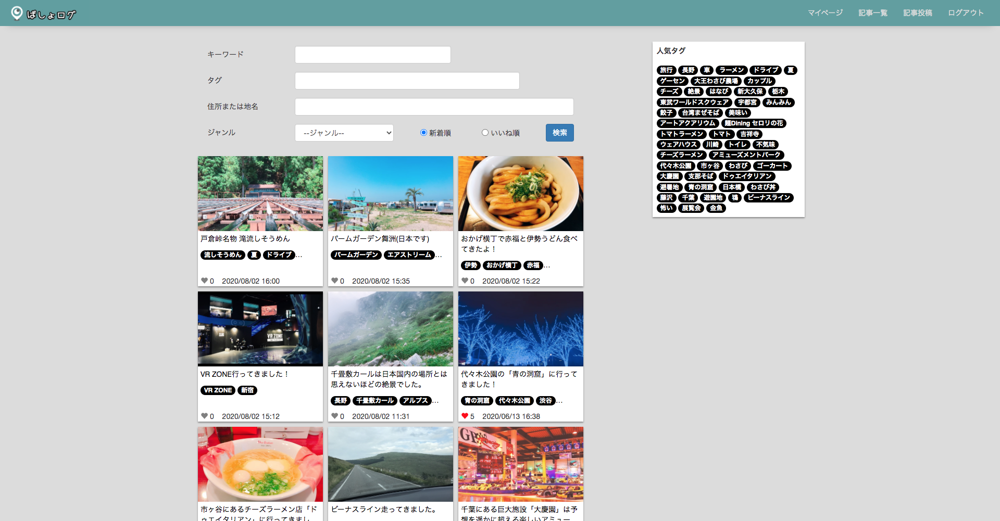
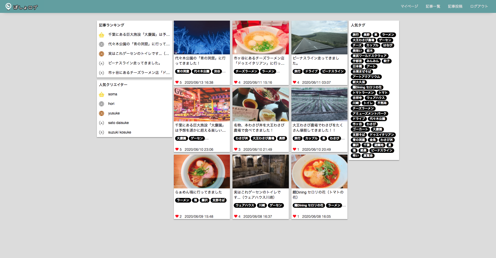
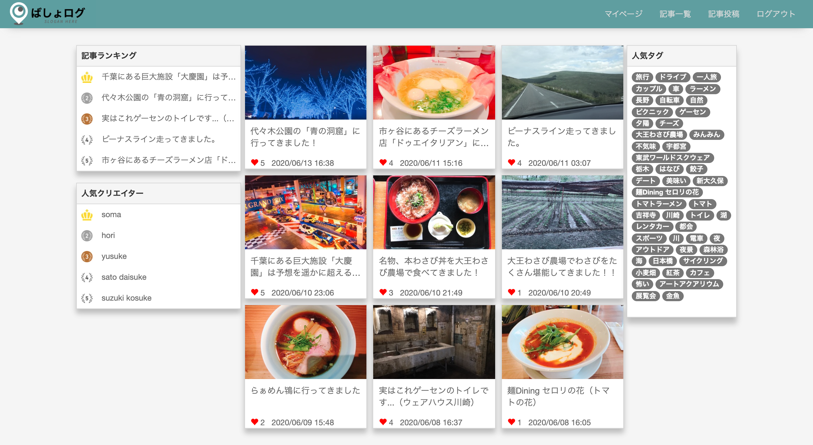

# ばしょログ

## サイト概要
ばしょログは共有したいスポットを記事として投稿することができます。また遊ぶ場所を探したり、旅行の計画を立てる時に、他の投稿者の記事を参考にすることもできます。

http://basyolog.net

### サイトテーマ
気軽に楽しかった場所や有意義だった場所を発信したり、スポットを検索できます。

### テーマを選んだ理由
WEBアプリケーションとしては王道な「ブログ」を基盤に、独自性として「場所」に注目しました。

### ターゲットユーザ
・楽しかった場所、思い出を共有したい人
・スポットを探している人

### 主な利用シーン
旅行の計画時、友人と遊びに行く場所を探す時、デートスポットを探す時

### 使用技術
<h3>フロントエンド</h3>
- HTML&CSS
- Javascript

<h3>バックエンド</h3>
- Ruby
- Ruby on Rails

<h3>インフラ</h3>
- AWS(EC2、RDS)
- Docker、docker-compose

<h3>その他</h3>
- Rspec
- MySQL

## 主な機能
- キーワード、住所、タグによるシームレスな検索機能

- ランキング機能

## 設計書
- ER図
https://drive.google.com/file/d/1PFTfvio3heCFniQRhC3ytIgJVDEz4yqT/view?usp=sharing
- ワイヤーフレーム
https://drive.google.com/file/d/16q3BsKG0lzQQkr5v94KDQt7YNNv3FxU-/view?usp=sharing

### 機能一覧
https://docs.google.com/spreadsheets/d/1dqCoy5gZYkliHLtHzWoDS5huSI74oz52TerJzSpxaDg/edit?usp=sharing

